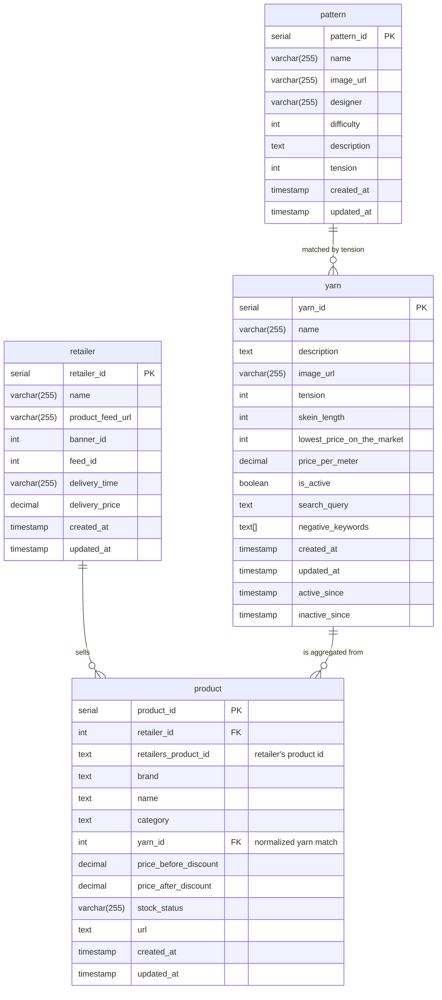

# Mermaid ER Diagram

```mermaid
erDiagram
    retailer {
        serial retailer_id PK
        varchar(255) name
        varchar(255) product_feed_url
        int banner_id
        int feed_id
        varchar(255) delivery_time
        decimal delivery_price
        timestamp created_at
        timestamp updated_at
    }

    product {
        serial product_id PK
        int retailer_id FK
        text retailers_product_id "retailer's product id"
        text brand
        text name
        text category
        int yarn_id FK "normalized yarn match"
        decimal price_before_discount
        decimal price_after_discount
        varchar(255) stock_status
        text url
        timestamp created_at
        timestamp updated_at
    }

    yarn {
        serial yarn_id PK
        varchar(255) name
        text description
        varchar(255) image_url
        int tension
        int skein_length
        int lowest_price_on_the_market
        decimal price_per_meter
        boolean is_active
        text search_query
        text[] negative_keywords
        timestamp created_at
        timestamp updated_at
        timestamp active_since
        timestamp inactive_since
    }

    pattern {
        serial pattern_id PK
        varchar(255) name
        varchar(255) image_url
        varchar(255) designer
        int difficulty
        text description
        int tension
        timestamp created_at
        timestamp updated_at
    }

    retailer ||--o{ product : "sells"
    yarn ||--o{ product : "is aggregated from"
    pattern ||--o{ yarn : "matched by tension"

```
