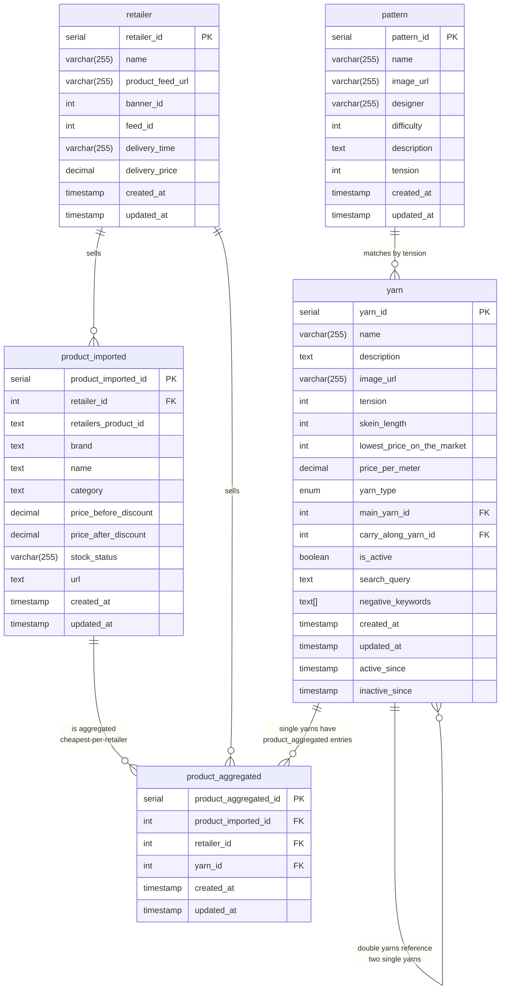

# garnalternativer.dk database diagram

```mermaid
erDiagram
    retailer {
        serial retailer_id PK
        varchar(255) name
        varchar(255) product_feed_url
        int banner_id
        int feed_id
        varchar(255) delivery_time
        decimal delivery_price
        timestamp created_at
        timestamp updated_at
    }

    product_imported {
        serial product_imported_id PK
        int retailer_id FK
        text retailers_product_id
        text brand
        text name
        text category
        decimal price_before_discount
        decimal price_after_discount
        varchar(255) stock_status
        text url
        timestamp created_at
        timestamp updated_at
    }

    product_aggregated {
        serial product_aggregated_id PK
        int product_imported_id FK
        int retailer_id FK
        int yarn_id FK
        timestamp created_at
        timestamp updated_at
    }

    yarn {
        serial yarn_id PK
        varchar(255) name
        text description
        varchar(255) image_url
        int tension
        int skein_length
        int lowest_price_on_the_market
        decimal price_per_meter
        enum yarn_type
        int main_yarn_id FK
        int carry_along_yarn_id FK
        boolean is_active
        text search_query
        text[] negative_keywords
        timestamp created_at
        timestamp updated_at
        timestamp active_since
        timestamp inactive_since
    }

    pattern {
        serial pattern_id PK
        varchar(255) name
        varchar(255) image_url
        varchar(255) designer
        int difficulty
        text description
        int tension
        timestamp created_at
        timestamp updated_at
    }

    product_imported ||--o{ product_aggregated : "is aggregated <br>cheapest-per-retailer"
    retailer ||--o{ product_imported : "sells"
    retailer ||--o{ product_aggregated : "sells"
    yarn ||--o{ product_aggregated : "single yarns have <br>product_aggregated entries"
    yarn ||--o{ yarn : "double yarns reference <br>two single yarns"
    pattern ||--o{ yarn : "matches by tension"
```
