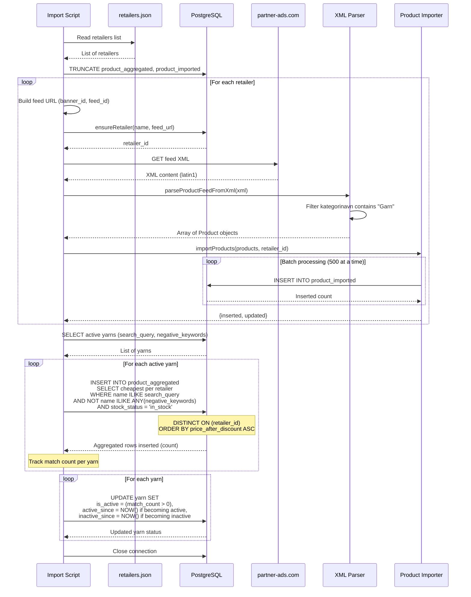

# Feed Import Sequence Diagram

```mermaid
sequenceDiagram
    participant Script as Import Script
    participant Config as retailers.json
    participant DB as PostgreSQL
    participant FeedAPI as partner-ads.com
    participant Parser as XML Parser
    participant Importer as Product Importer

    Script->>Config: Read retailers list
    Config-->>Script: List of retailers

    Script->>DB: TRUNCATE product_aggregated, product_imported

    loop For each retailer
        Script->>Script: Build feed URL (banner_id, feed_id)
        Script->>DB: ensureRetailer(name, feed_url)
        DB-->>Script: retailer_id
        
        Script->>FeedAPI: GET feed XML
        FeedAPI-->>Script: XML content (latin1)
        
        Script->>Parser: parseProductFeedFromXml(xml)
        Parser->>Parser: Filter kategorinavn contains "Garn"
        Parser-->>Script: Array of Product objects
        
        Script->>Importer: importProducts(products, retailer_id)
        loop Batch processing (500 at a time)
            Importer->>DB: INSERT INTO product_imported
            DB-->>Importer: Inserted count
        end
        Importer-->>Script: {inserted, updated}
    end

    Script->>DB: SELECT active yarns (search_query, negative_keywords)
    DB-->>Script: List of yarns

    loop For each active yarn
        Script->>DB: INSERT INTO product_aggregated<br/>SELECT cheapest per retailer<br/>WHERE name ILIKE search_query<br/>AND NOT name ILIKE ANY(negative_keywords)<br/>AND stock_status = 'in_stock'
        Note over DB: DISTINCT ON (retailer_id)<br/>ORDER BY price_after_discount ASC
        DB-->>Script: Aggregated rows inserted (count)
        Note over Script: Track match count per yarn
    end

    loop For each yarn
        Script->>DB: UPDATE yarn SET<br/>is_active = (match_count > 0),<br/>active_since = NOW() if becoming active,<br/>inactive_since = NOW() if becoming inactive
        DB-->>Script: Updated yarn status
    end

    Script->>DB: Close connection
```
